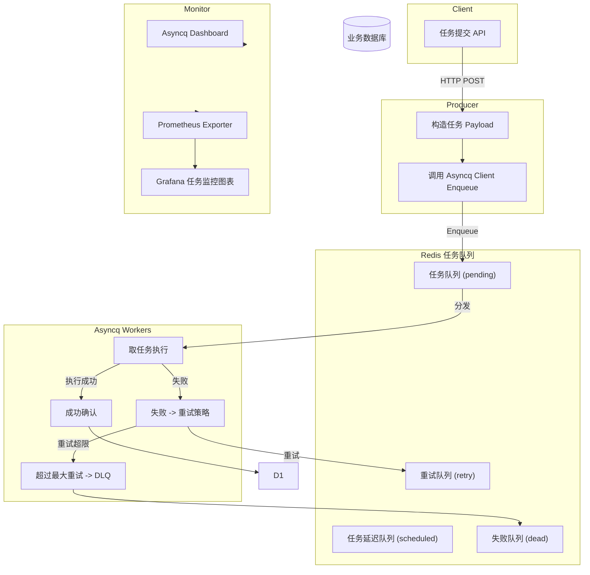
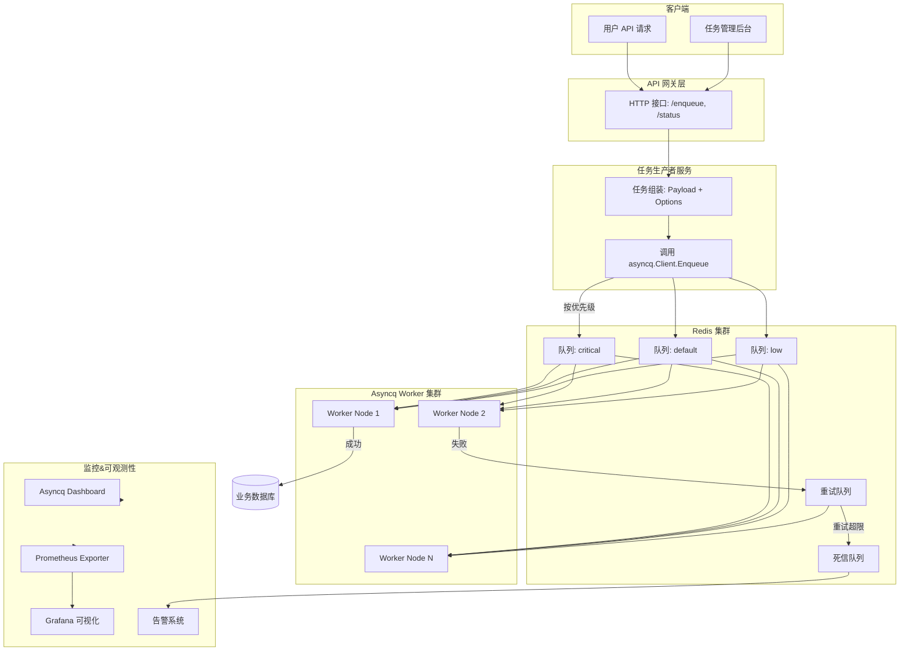

## 设计系统
关注
	是否要支持延时任务？Asyncq 内置支持 `ProcessIn`、`ProcessAt`
	是否要支持任务优先级？ Asyncq 支持优先队列，需设计多个 queue 名称（如 `critical`, `default`, `low`）
	是否要分布式部署？多个 Asyncq Server 共享 Redis。
	是否要幂等执行？防止任务重复消费。
	模型设计
		任务结构：包含 `ID、Payload（业务参数）、重试策略、TTL、优先级`
		类型：比如发送邮件、生成报表、推送消息
		幂等：设计 **去重 Key** 或 **状态机**
	可靠性设计：
		重试策略：Asyncq 支持 **Exponential Backoff**，可自定义；考虑最大重试次数 & 死信队列（DLQ）
		持久化：Redis 内部存储，如果 Redis 挂了怎么办？考虑 **持久化 Redis (AOF/RDB)** 或 **备份**
		超时：Asyncq 支持 `MaxRetry`, `Timeout`
		幂等性保证：使用 **业务唯一 ID**，防止重复执行
		死信处理：异常任务进入 `failed queue`，是否需要告警或人工处理
	性能与扩展：
		redis性能瓶颈：考虑redis集群
		Asyncq 并发配置：`Concurrency` 参数设置，CPU 密集型 vs IO 密集型任务不同策略
		批量提交任务：减少网络 RTT
		任务分片：业务上拆分大任务，防止一个任务执行太久
		队列隔离：高优先级任务独立 queue
	监控：
		Asyncq Dashboard：Web UI，可以看 pending / processed / failed
		Prometheus 指标：自定义指标：任务耗时、失败率
		日志设计：每个任务执行记录
		告警：重试过多、死信任务数暴增
		Grafana 如何画任务处理速度趋势图？ 
	**安全与扩展**：
		安全：Redis 需要认证（避免公开暴露）
		多租户设计saas化：每个租户单独队列或队列前缀
		水平扩展：增加 Asyncq Worker 节点
		跨区域部署：Redis 延迟影响大，考虑区域队列

架构：
	- **任务生产**
    - API 收到请求，构造任务 Payload（JSON）。
    - 使用 `asyncq.Client.Enqueue()` 提交任务到 Redis。
- **Redis 队列结构**
    - **pending**：待执行任务。
    - **scheduled**：延迟执行任务。
    - **retry**：失败重试任务。
    - **dead**：超过最大重试次数的任务（死信队列）。
- **Asyncq Worker**
    - 从 Redis 取任务，执行用户逻辑。
    - 成功：ACK + 更新业务状态。
    - 失败：根据重试策略重新入队。
    - 超过重试次数：进入死信队列，触发告警或人工处理。
- **监控**
    - Asyncq 提供 Dashboard 查看任务状态。
    - Prometheus 采集指标，Grafana 绘制任务处理速率、失败率。

2.高级架构
- **多租户设计**：可以在任务 ID 或队列名前加租户前缀（如 `tenant1:default`）。
- **优先级队列**：critical（高优）、default（普通）、low（低优）。
- **多 Worker 扩展**：水平扩展，支持 Kubernetes 部署。
- **重试策略**：失败进入 Retry Queue，超过 `MaxRetry` 进入 DLQ。
- **监控体系**：Asyncq Dashboard + Prometheus（采集 metrics）+ Grafana（告警、趋势图）。
- **任务管理后台**：支持人工重试、DLQ 处理

