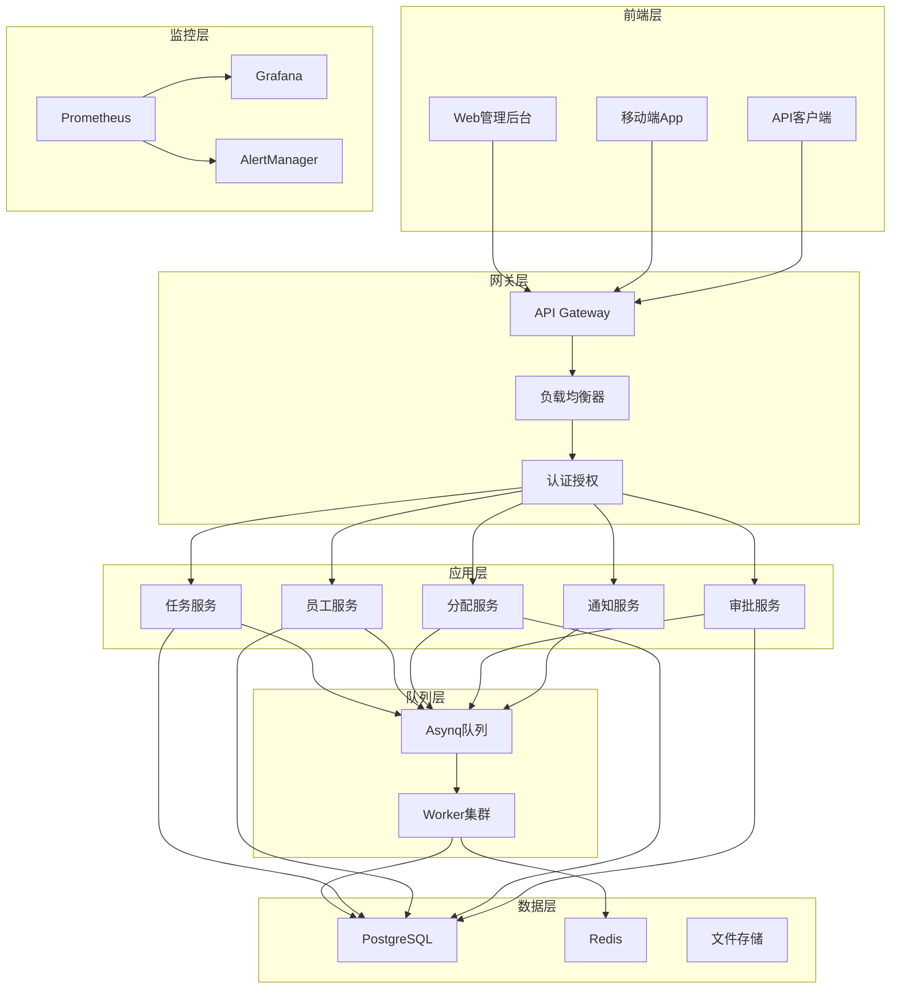
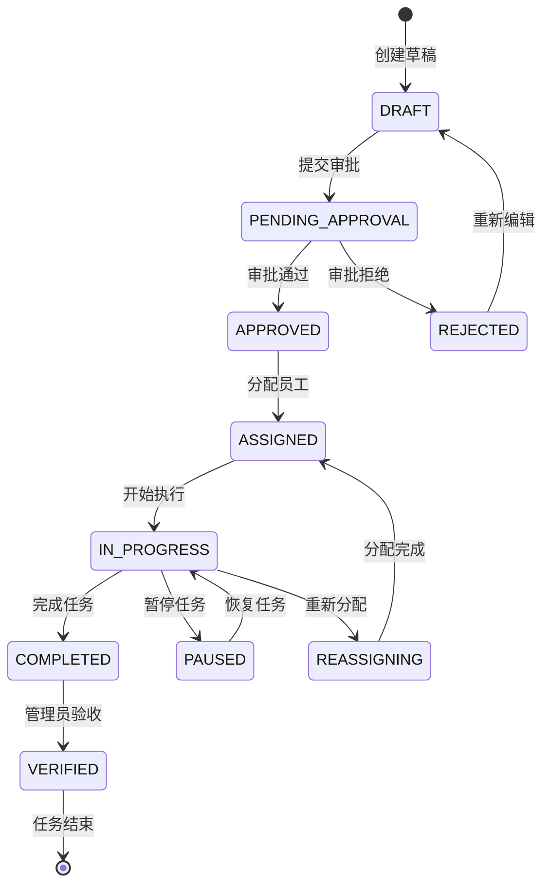
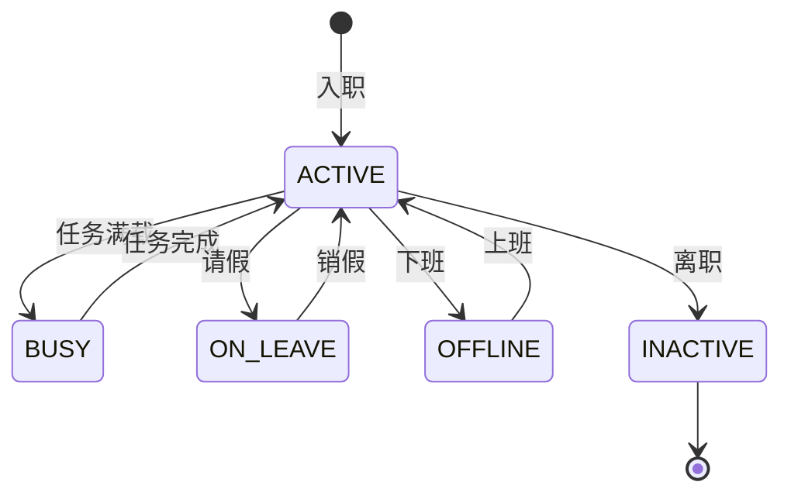
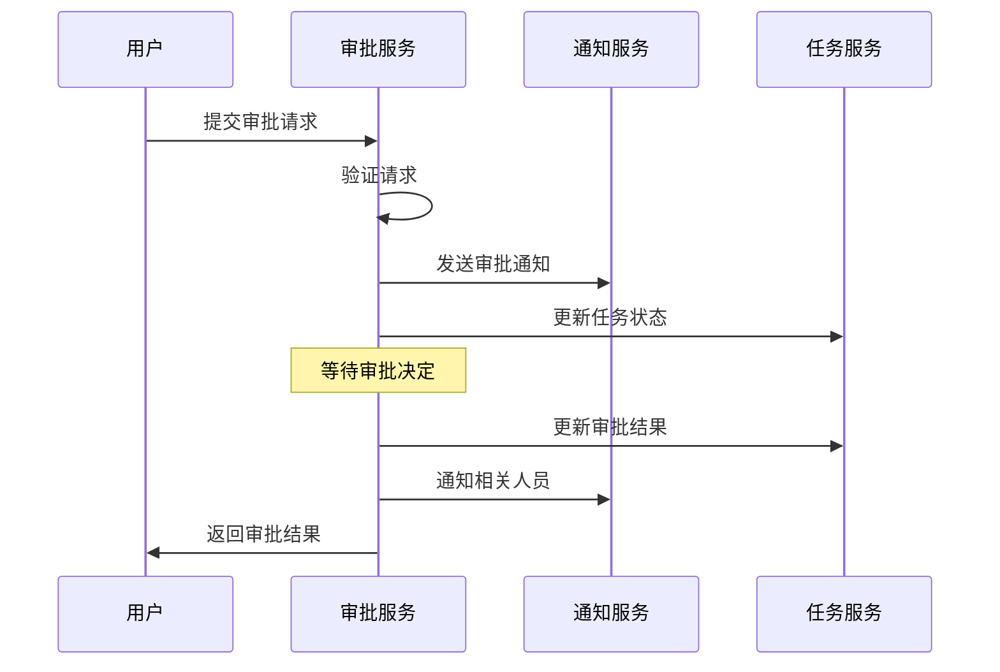
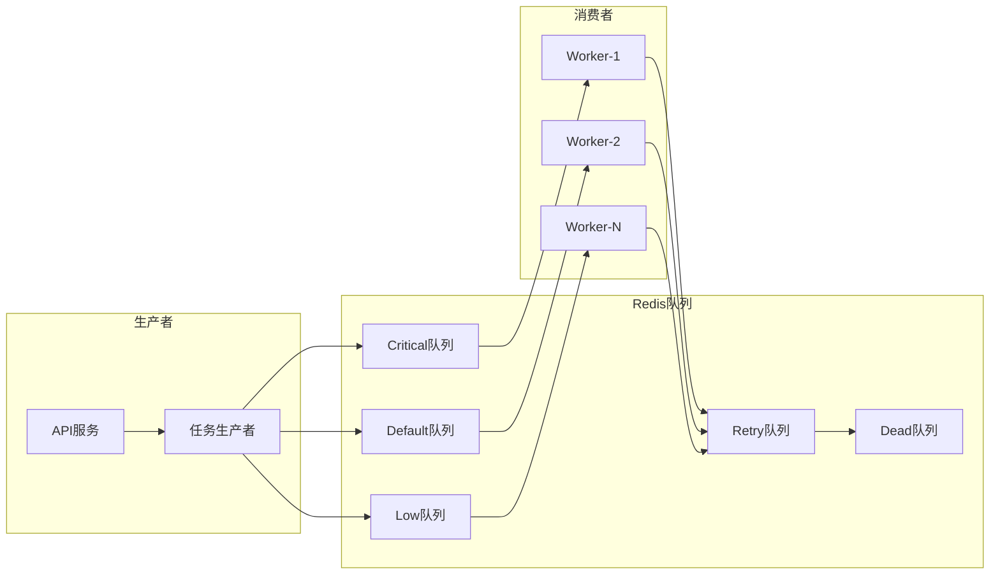
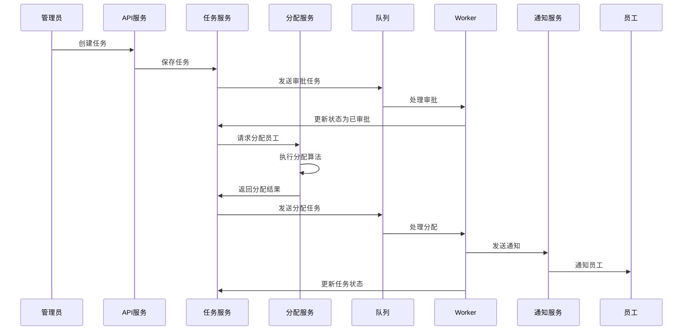
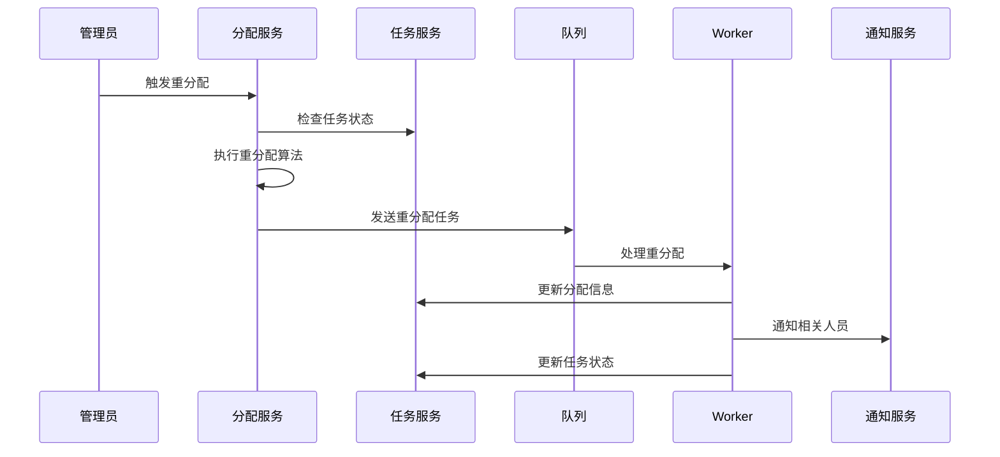

# 系统架构设计

## 整体架构

### 分层架构



## 核心服务设计

### 1. 任务服务 (Task Service)

**职责**: 任务的完整生命周期管理

**核心功能**:
- 任务CRUD操作
- 状态流转管理
- 优先级调整
- 截止时间管理
- 任务依赖关系

**状态流转**:


### 2. 员工服务 (Staff Service)

**职责**: 员工信息和状态管理

**核心功能**:
- 员工档案管理
- 技能标签管理
- 工作状态跟踪
- 负载监控
- 请假管理

**员工状态**:


### 3. 分配服务 (Assignment Service)

**职责**: 智能任务分配和负载均衡

**分配算法**:

#### 轮询分配 (Round Robin)
```go
func RoundRobinAssign(task *Task, staff []Staff) *Staff {
    // 简单轮询，适用于技能要求不高的任务
    return &staff[task.ID % len(staff)]
}
```

#### 负载均衡分配 (Load Balance)
```go
func LoadBalanceAssign(task *Task, staff []Staff) *Staff {
    // 选择当前负载最低的员工
    minLoad := math.MaxInt32
    var selected *Staff
    for _, s := range staff {
        if s.CurrentLoad < minLoad && s.Status == ACTIVE {
            minLoad = s.CurrentLoad
            selected = &s
        }
    }
    return selected
}
```

#### 技能匹配分配 (Skill Match)
```go
func SkillMatchAssign(task *Task, staff []Staff) *Staff {
    // 计算技能匹配度，选择最匹配的员工
    bestMatch := 0.0
    var selected *Staff
    for _, s := range staff {
        score := calculateSkillMatch(task.RequiredSkills, s.Skills)
        if score > bestMatch && s.Status == ACTIVE {
            bestMatch = score
            selected = &s
        }
    }
    return selected
}
```

#### 综合算法 (Hybrid)
```go
func HybridAssign(task *Task, staff []Staff) *Staff {
    // 综合考虑技能匹配、负载均衡、优先级
    bestScore := 0.0
    var selected *Staff
    for _, s := range staff {
        skillScore := calculateSkillMatch(task.RequiredSkills, s.Skills)
        loadScore := 1.0 - float64(s.CurrentLoad)/float64(s.MaxLoad)
        priorityScore := getPriorityScore(task.Priority, s.Level)
        
        totalScore := skillScore*0.5 + loadScore*0.3 + priorityScore*0.2
        if totalScore > bestScore && s.Status == ACTIVE {
            bestScore = totalScore
            selected = &s
        }
    }
    return selected
}
```

### 4. 审批服务 (Approval Service)

**职责**: 审批流程管理

**审批类型**:
- 任务创建审批
- 任务完成审批
- 重分配审批
- 优先级变更审批

**审批流程**:


## 队列设计

### Asynq 队列架构



### 队列配置

```yaml
queues:
  critical:
    concurrency: 6
    priority: 10
    max_retry: 5
  default:
    concurrency: 3
    priority: 5
    max_retry: 3
  low:
    concurrency: 1
    priority: 1
    max_retry: 1
```

### 任务类型定义

```go
const (
    TaskTypeAssignment    = "task:assignment"
    TaskTypeNotification  = "task:notification"
    TaskTypeReassignment  = "task:reassignment"
    TaskTypeStatusUpdate  = "task:status_update"
    TaskTypeApproval      = "task:approval"
)
```

## 数据流设计

### 任务分配流程



### 重分配流程



## 扩展性设计

### 水平扩展

1. **API服务扩展**: 无状态设计，支持多实例部署
2. **Worker扩展**: 支持动态增减Worker节点
3. **数据库扩展**: 读写分离，分库分表
4. **Redis扩展**: Redis Cluster模式

### 高可用设计

1. **服务冗余**: 每个服务至少2个实例
2. **数据备份**: 数据库主从复制，Redis持久化
3. **故障转移**: 自动故障检测和切换
4. **限流熔断**: 防止系统过载

### 性能优化

1. **缓存策略**: 多级缓存，热点数据缓存
2. **异步处理**: 耗时操作异步化
3. **批量操作**: 减少数据库交互次数
4. **连接池**: 数据库连接池优化

## 安全设计

### 认证授权

1. **JWT Token**: 无状态认证
2. **RBAC权限**: 基于角色的访问控制
3. **API限流**: 防止恶意请求
4. **数据加密**: 敏感数据加密存储

### 审计日志

1. **操作日志**: 记录所有关键操作
2. **访问日志**: API访问记录
3. **错误日志**: 系统错误追踪
4. **性能日志**: 性能指标记录
