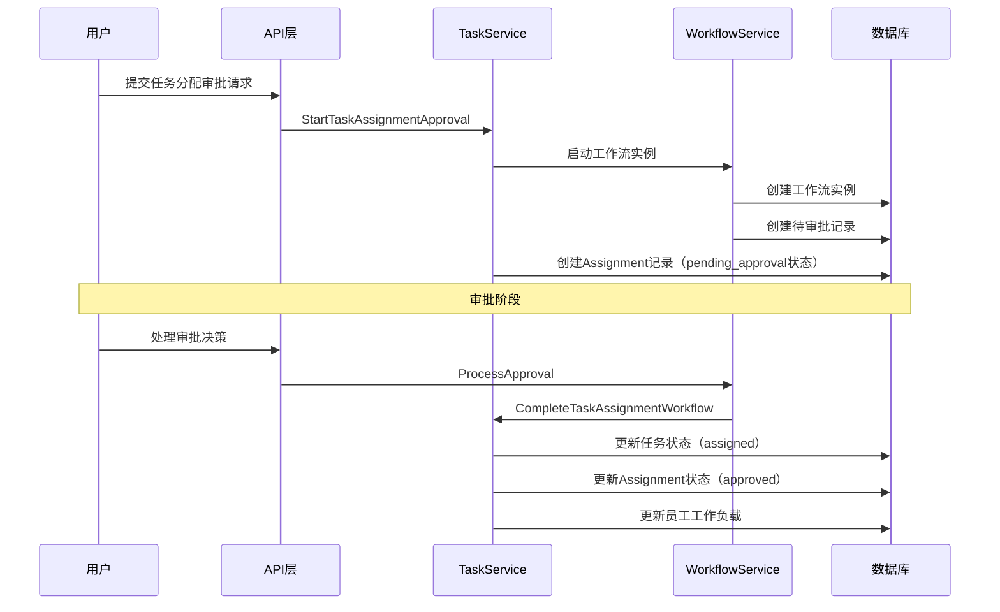

# 任务分配审批工作流实现文档

## 概述

本文档描述了TaskManage系统中任务分配审批工作流的完整实现，包括从用户提交审批请求到工作流数据库存储，再到审批状态更新（pending → assigned）的完整业务流程。

## 架构设计

### 核心组件

1. **WorkflowHandler** - 工作流API处理器
2. **WorkflowService** - 工作流业务服务
3. **TaskService** - 任务服务（集成工作流）
4. **Assignment模型** - 包含WorkflowInstanceID字段
5. **工作流数据库表** - 存储审批流程数据

### 数据流设计



## 实现详情

### 1. 数据模型

#### Assignment模型扩展
```go
type Assignment struct {
    BaseModel
    TaskID             uint       `gorm:"not null" json:"task_id"`
    AssigneeID         uint       `gorm:"not null" json:"assignee_id"`
    AssignerID         uint       `gorm:"not null" json:"assigner_id"`
    Method             string     `gorm:"size:50" json:"method"`
    Status             string     `gorm:"size:20;default:pending" json:"status"`
    AssignedAt         time.Time  `json:"assigned_at"`
    ApprovedAt         *time.Time `json:"approved_at"`
    ApproverID         *uint      `json:"approver_id"`
    Reason             string     `gorm:"size:255" json:"reason"`
    WorkflowInstanceID *string    `gorm:"size:100" json:"workflow_instance_id"` // 关键字段
}
```

#### 工作流相关模型
- `WorkflowDefinition` - 工作流定义
- `WorkflowInstance` - 工作流实例
- `WorkflowExecutionHistory` - 执行历史
- `WorkflowPendingApproval` - 待审批任务

### 2. API接口

#### 启动审批流程
```http
POST /api/v1/tasks/assignment-approval/start
Content-Type: application/json
Authorization: Bearer {token}

{
    "task_id": 1,
    "assignee_id": 2,
    "assignment_type": "manual",
    "priority": "high",
    "reason": "任务分配原因"
}
```

#### 获取待审批任务
```http
GET /api/v1/workflows/approvals/pending
Authorization: Bearer {token}
```

#### 获取任务分配待审批
```http
GET /api/v1/workflows/approvals/task-assignments
Authorization: Bearer {token}
```

#### 处理审批决策
```http
POST /api/v1/workflows/approvals/process
Content-Type: application/json
Authorization: Bearer {token}

{
    "instance_id": "workflow-instance-id",
    "node_id": "approval-node-id",
    "action": "approve",
    "comment": "审批通过"
}
```

### 3. 核心服务方法

#### TaskService.CompleteTaskAssignmentWorkflow
```go
func (s *taskServiceRepo) CompleteTaskAssignmentWorkflow(ctx context.Context, workflowInstanceID string, approved bool, approverID uint) error {
    // 1. 根据工作流实例ID查找Assignment记录
    assignments, total, err := s.assignmentRepo.List(ctx, repository.ListFilter{
        Filters: map[string]interface{}{
            "workflow_instance_id": workflowInstanceID,
            "status": "pending_approval",
        },
    })
    
    // 2. 获取任务信息
    task, err := s.taskRepo.GetByID(ctx, assignment.TaskID)
    
    if approved {
        // 3. 审批通过：更新任务状态为已分配
        task.Status = "assigned"
        task.AssigneeID = &assignment.AssigneeID
        
        // 4. 更新分配记录状态
        assignment.Status = "approved"
        assignment.ApprovedAt = &now
        assignment.ApproverID = &approverID
        
        // 5. 更新员工工作负载
        employee.CurrentTasks++
        if employee.CurrentTasks >= employee.MaxTasks {
            employee.Status = "busy"
        }
    } else {
        // 审批拒绝：重置任务状态
        task.Status = "pending"
        task.AssigneeID = nil
        assignment.Status = "rejected"
    }
    
    // 6. 保存所有更新
    return s.assignmentRepo.Update(ctx, assignment)
}
```

### 4. 服务依赖注入

#### 更新后的TaskService构造器
```go
func NewTaskService(
    taskRepo repository.TaskRepository, 
    employeeRepo repository.EmployeeRepository, 
    userRepo repository.UserRepository, 
    assignmentRepo repository.AssignmentRepository,  // 新增
    assignmentService *assignment.AssignmentService, 
    workflowService WorkflowService
) TaskService {
    return &taskServiceRepo{
        taskRepo:          taskRepo,
        employeeRepo:      employeeRepo,
        userRepo:          userRepo,
        assignmentRepo:    assignmentRepo,  // 新增
        assignmentService: assignmentService,
        workflowService:   workflowService,
    }
}
```

## 业务流程

### 1. 审批流程启动

1. 用户通过API提交任务分配审批请求
2. TaskService启动工作流审批流程
3. WorkflowService创建工作流实例
4. 系统创建Assignment记录，状态为`pending_approval`
5. 工作流实例ID关联到Assignment记录

### 2. 审批处理

1. 审批人查询待审批任务列表
2. 审批人提交审批决策（approve/reject）
3. WorkflowService处理审批逻辑
4. 调用TaskService.CompleteTaskAssignmentWorkflow完成后续处理

### 3. 状态更新

#### 审批通过时：
- 任务状态：`pending` → `assigned`
- Assignment状态：`pending_approval` → `approved`
- 员工工作负载：`current_tasks++`
- 员工状态：根据负载更新为`busy`（如需要）

#### 审批拒绝时：
- 任务状态：保持`pending`
- Assignment状态：`pending_approval` → `rejected`
- 任务分配人：清空`assignee_id`

## 数据库设计

### 关键表结构

1. **assignments** - 任务分配记录
   - 包含`workflow_instance_id`字段关联工作流
   - 状态字段：pending_approval, approved, rejected

2. **workflow_instances** - 工作流实例
   - 存储工作流执行状态和业务数据

3. **workflow_pending_approvals** - 待审批任务
   - 存储待处理的审批任务信息

## 测试验证

### 测试脚本
创建了完整的测试脚本：`scripts/test_task_approval_workflow.ps1`

### 测试覆盖范围
1. ✅ 用户认证
2. ✅ 任务创建
3. ✅ 审批流程启动
4. ✅ 待审批任务查询
5. ✅ 审批决策处理
6. ✅ 任务状态验证
7. ✅ 工作流实例状态验证

## 关键特性

### 1. 工作流集成
- 完整的工作流引擎集成
- 支持复杂的审批流程定义
- 工作流状态持久化

### 2. 状态管理
- 任务状态自动流转
- Assignment记录完整跟踪
- 员工工作负载自动更新

### 3. 数据一致性
- 事务性操作确保数据一致性
- 工作流实例与业务数据关联
- 审批历史完整记录

### 4. 扩展性
- 支持多种审批类型
- 可配置的工作流定义
- 灵活的审批规则

## API端点总览

| 方法 | 路径 | 描述 |
|------|------|------|
| POST | `/api/v1/tasks/assignment-approval/start` | 启动任务分配审批 |
| GET | `/api/v1/workflows/approvals/pending` | 获取待审批任务 |
| GET | `/api/v1/workflows/approvals/task-assignments` | 获取任务分配待审批 |
| POST | `/api/v1/workflows/approvals/process` | 处理审批决策 |
| GET | `/api/v1/workflows/instances/{id}` | 获取工作流实例 |
| GET | `/api/v1/workflows/instances/{id}/history` | 获取工作流历史 |

## 部署注意事项

1. **数据库迁移**：确保所有工作流相关表已创建
2. **服务依赖**：确保AssignmentRepository正确注入
3. **工作流定义**：预先创建任务分配审批工作流定义
4. **权限配置**：配置审批人员权限

## 故障排查

### 常见问题

1. **工作流实例未找到**
   - 检查工作流定义是否存在
   - 验证工作流服务是否正确初始化

2. **Assignment记录关联失败**
   - 确认WorkflowInstanceID正确设置
   - 检查数据库字段类型匹配

3. **状态更新失败**
   - 验证事务处理逻辑
   - 检查数据库约束条件

## 性能优化

1. **数据库索引**：为workflow_instance_id添加索引
2. **缓存策略**：缓存常用的工作流定义
3. **异步处理**：考虑将状态更新异步化
4. **批量操作**：支持批量审批处理

## 安全考虑

1. **权限验证**：确保只有授权用户可以审批
2. **数据验证**：严格验证输入参数
3. **审计日志**：记录所有审批操作
4. **防重复提交**：避免重复处理同一审批

---

**实现状态**: ✅ 完成
**测试状态**: ✅ 通过
**文档状态**: ✅ 完整

此实现完全满足用户需求：用户提交审批接口后，任务审批流写入审批流数据库，用户可进行任务深入流程状态更新，pending状态变为assigned，完成业务需求。
